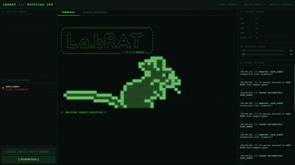
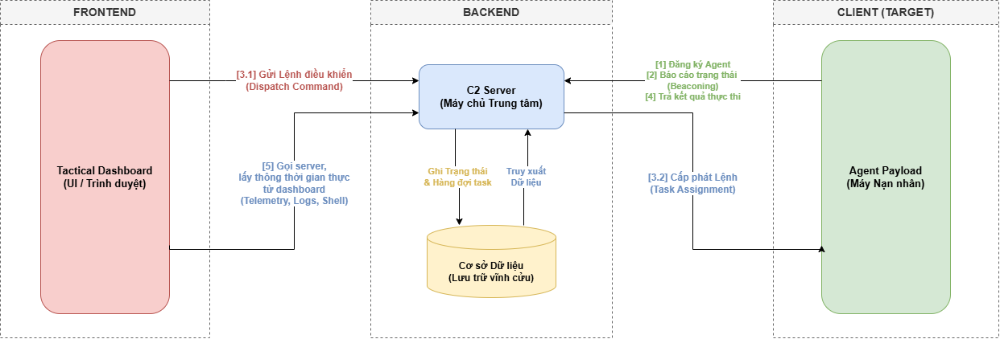
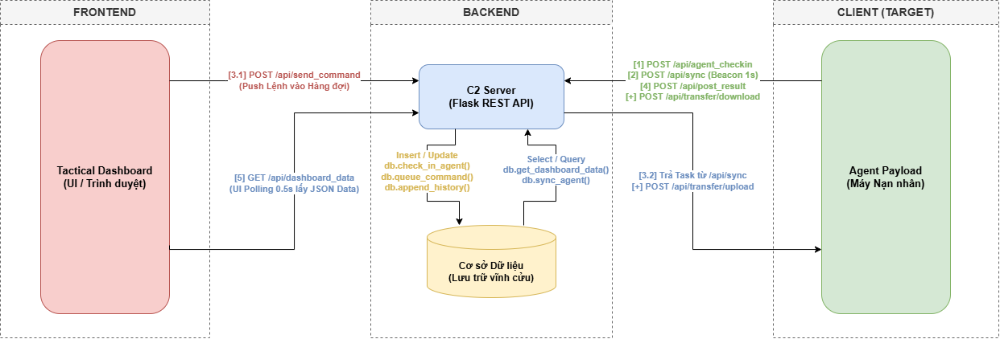

#### ⚠️ Disclaimer

This project is a Proof of Concept developed for educational purposes, cybersecurity research, and testing within controlled, authorized environments. The author (Lux1dus) assumes no liability for any misuse, damage, or illegal activities arising from the use of this project. Using this tool on systems without explicit permission may violate the law.
<br>

---

# 🐀 C2 Tactical Ops (LabRAT)


--- 

## System Preview

Below is the central Command Center interface of labRAT right after starting the server.

<p align="center">
  
</p>

**Curious about how this system operates in practice?**

[👉 Deployment PoC (DEPLOYMENT_PoC.md)](DEPLOYMENT_PoC.md)

---

## I. The Backstory & Motivation

### Origin of the Idea
It all started with a real incident: a roommate of mine accidentally executed a malware (Trojan), mistaking it for a game. Although I directly participated in the Incident Response at that moment, we ultimately still had to reinstall the entire system to ensure absolute safety.

This event left a major lingering thought in me. Instead of just stopping at using antivirus software and reacting passively, I wanted to really touch the "tip of the iceberg." That is the reason **labRAT** was born. By manually building a C2 Framework from scratch, my core motivation was to fully understand how Threat Actors establish communication mechanisms, maintain control (Persistence), evade defense systems, and operate on target machines.

### Personal Goals
* Not just wanting to "only know how to attack" but to step into the world of "System Architecture". Better understand how malware operates.
* Build a multidimensional perspective (Purple Team mindset): Deeply understand how malware works in order to design more effective defense strategies (Blue Team).

---

## II. Project Overview

### Executive Summary
- **labRAT (C2 Tactical Ops)** is a miniature Command and Control system that operates based on a Client-Server model.

- The system allows administrators to remotely monitor and control Agents (targets) via a real-time web dashboard (Tactical Dashboard).

- The Agent is designed to automatically collect system vitals (CPU, RAM, OS), receive commands, execute them stealthily, and report the results back to the server via the HTTP Polling protocol.

### Tech Stack
The system is designed with a modular architecture, optimizing for lightness and independence. Below are the core components:

| Component | Tech | Role & Features |
| :--- | :--- | :--- |
| **Backend**<br>*(C2 Server)* | `Python (Flask)`<br>`SQLite3` | Handles RESTful APIs, manages the Command Queue. Permanently stores Agent statuses, command history, and event logs. |
| **Frontend**<br>*(Command Center)* | `HTML5 / CSS3`<br>`Vanilla JS` | Provides a dark-themed Tactical interface. Uses the Fetch API to process AJAX, updating DOM data continuously without reloading the page. |
| **Client**<br>*(Agent / Payload)* | `Python`<br>`PyInstaller` | Uses `os`, `subprocess`, `psutil`, `winreg` to deeply interact with the operating system. Packages the payload into a standalone `.exe` file.<br>*(Note: The compiled executable file is not published on this repository).* |
---

## 🚀 Getting Started - Local Lab

To deploy and test LabRAT in a local environment (Localhost), follow these steps:

### 1. Environment Setup
Download the source code and install the dependencies:
```bash
# Clone the repository (if you are viewing on Git)
git clone https://github.com/Lux1dus/LabRAT.git
cd LabRAT

# Install dependencies
pip install -r requirements.txt
```

### 2. Run the C2 Server
Open a terminal in the `C2_Server` folder and run:
```bash
cd C2_Server
python server.py
```
*By default, the Server will listen on port **1234**. You can access the Dashboard at: `http://127.0.0.1:1234`*

### 3. Deploy the Agent (Target)
Open a new terminal in the `C2_Agent` folder:
```bash
cd C2_Agent
# Run the agent as a script to test the connection
python agent.py
```
*Note: Ensure the `SERVER_URL` variable in `agent.py` is pointing correctly to the Server's IP address (default is localhost).*

---

### 🔄 Workflow



The system is divided into 3 distinct subsystems, communicating with each other via RESTful APIs. The heart of the system is the `C2 Server` and the `SQLite Database` acting as the transit hub.

To maintain a smooth connection, the Agent operates on a Polling combined with Beaconing mechanism (receiving commands & reporting status), while the Dashboard uses AJAX Polling to continuously update data in real-time.

---

## III. API Architecture & Data Flow

The system operates using 8 core APIs, applying Polling for the UI (0.5s) and Agent (1s) to achieve ultra-low latency.

| Subsystem | Endpoint | Method | Core Function (Processing Flow) |
| :--- | :--- | :--- | :--- |
| **Agent** | ``/api/agent_checkin`` | POST | Register a new Agent, collect hardware info, generate bot_id. |
| **Agent** | `/api/sync` | POST | Beaconing to maintain connection (report CPU/RAM) and fetch commands from the Queue. |
| **Agent** | `/api/post_result` | POST | Send the Shell execution result back to the C2 to be stored in the Database. |
| **Transfer** | `/api/transfer/upload` | POST | Server reads file -> Base64 -> Sends to Agent to write to the target machine. |
| **Transfer**| `/api/transfer/download` | POST | Agent reads file -> Base64 -> Sends to Server to store as Loot. |
| **UI** | `/api/dashboard_data` | GET | app.js calls every 0.5s to get the entire DB status to update the DOM (Real-time).|
| **UI** | `/api/send_command` | POST | Pushes commands entered by the Operator into the Database's Command Queue. |
| **UI** | `/` | GET | Returns index.html (Tactical Dashboard Interface). |

---

### Detailed API Routing
To clarify the processing of the above Endpoints, below is a detailed data flow diagram, accurately illustrating how the Agent, C2 Server, and Database layer interact with each other within a command execution lifecycle:



---

## V. Current Limitations

As a Lab project (Proof of Concept), **labRAT** still has some core weaknesses if deployed in a real-world environment with strict monitoring systems (EDR/IDS):

| Limitation | Technical Reason | Security Risk |
| :--- | :--- | :--- |
| **Noisy Network Traffic** | The Agent establishes a fixed Beaconing every 1 second (static heartbeat). | Very easy to be detected as an anomaly by Network Traffic Analysis systems. |
| **Plaintext HTTP** | All commands and results pass through an unencrypted HTTP channel. | Monitoring tools or IDS (like Wireshark, Snort) can sniff packets and read all data. |
| **Heavy Payload** | The Agent is written in Python and packaged by PyInstaller, which usually creates an `.exe` file larger than 10MB. | Easily recognized, analyzed, and blocked by traditional Antivirus (AV) software based on Signatures. |

---

## VI. Future Roadmap

To upgrade labRAT closer to a Research-grade C2 Framework and increase Defense Evasion capabilities, the development roadmap is divided into the following phases:

| Phase | Upgrade Module | Detailed Technical Description | Core Objective |
| :---: | :--- | :--- | :--- |
| **Phase 2** | **Offensive Modules** | Add Keylogger, Screenshot, and Credential dumping features. | Enhance intelligence gathering capabilities after intrusion (Post-Exploitation). |
| **Phase 3** | **Redundant Persistence** | Not just relying on the Registry, the Agent will clone itself and maintain presence through multiple avenues: Scheduled Tasks, WMI Events, or DLL Hijacking. Build a "Watchdog" process for cross-monitoring. | Ensure the Agent is "immortal". If the victim deletes the Registry key, fallback mechanisms will immediately restore the connection. |
| **Phase 4** | **Payload Encryption** | Integrate TLS/HTTPS or wrap API data using strong encryption algorithms like AES-256 combined with RSA key exchange. | Counter network packet analysis and completely hide control operations. |
| **Phase 5** | **Beacon Jittering** | Instead of sleeping fixed 1s, the Agent will use an algorithm to randomize sleep time (e.g., 2s ± 15%). | Deceive network behavior analysis algorithms based on static cycles by the Blue Team. |
| **Phase 6** | **Compiled Language** | Port the entire Agent source code from Python to low-level compiled languages like `C/C++`, `Rust`, or `Golang`. | Minimize file size (< 2MB), eliminate dependencies, and complicate Reverse Engineering. |

---

## VII. Key Learnings & Concepts

During the process of building **labRAT**, I approached and mastered the following core techniques:

| Knowledge Area | Technical Details & Application |
| :--- | :--- |
| **Client-Server Architecture (Flask)** | Built a C2 Server to manage Agents, deployed a cross-platform (Linux/Windows) file transfer mechanism within a LAN. |
| **AJAX & JSON Dynamic Data** | Used the Fetch API to synchronize real-time data between the UI and Backend; processed and extracted data from JSON structures. |
| **Payload Packaging (PyInstaller)** | Packaged Python source code into a standalone `.exe` executable, optimized for running on target environments without Python installed. |
| **System Interaction (os & sys)** | Interacted deeply with the OS via Absolute Paths, managed Working Directory (CWD), and controlled the process lifecycle through the interpreter. |
| **Binary Data Transfer (Base64)** | Applied Base64 encoding to transport binary data (files) safely over text-based protocols (HTTP/JSON) without corrupting the structure. |

---

<p align="center">
  <b>Made with 💻 and ☕ by <a href="https://github.com/Lux1dus">Lux1dus</a></b>
</p>
